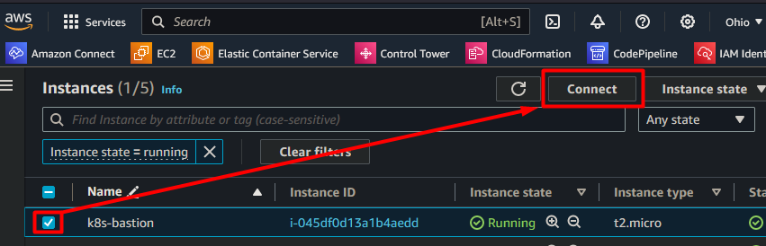
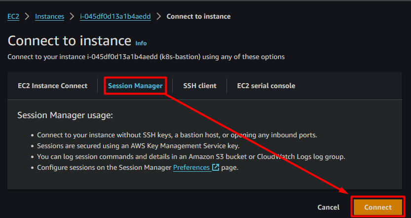

# Linux Bastion Host

This Pulumi project creates a bastion host inside a Auto Scaling Group (ASG) to ensure that the bastion host is always available. The bastion host is created in a private subnet and is accessible via AWS Systems Manager (SSM) Session Manager only; no ssh keys is attached to the instance, and no security group allows inbound traffic from the internet.

A set of CLI tools are pre-installed on the bastion host to simplify EKS cluster administration. The `user_data.sh` file contains the complete list of installed tools and settings.

This solution is based on the following AWS blog post: [Linux Bastion Hosts on AWS](https://aws.amazon.com/solutions/implementations/linux-bastion/)

## Solution Diagram:


## How to connect to the bastion host using AWS Systems Manager (SSM) Session Manager:

### Prerequisites:

- AWS CLI installed and configured
  - [How to install and configure the AWS CLI](https://docs.aws.amazon.com/cli/latest/userguide/install-cliv2.html)
- AWS Systems Manager (SSM) Session Manager plugin installed
  - [How to install the SSM plugin](https://docs.aws.amazon.com/systems-manager/latest/userguide/session-manager-working-with-install-plugin.html)
- The bastion host is created and running

### Connect to the bastion host using SSM Session Manager from the AWS Management Console:

1. Open the AWS Management Console and navigate to the EC2 service.
2. Select the bastion host instance.
3. Click on the "Connect" button.
4. Click on the "Session Manager" tab.
5. Click on the "Connect" button.





### Connect to the bastion host using SSM Session Manager from the AWS CLI:

1. Make sure that the AWS CLI is installed and configured.
2. Run the following command to start a session with the bastion host

> If your are using a profile, make sure to specify the profile using the `--profile` option.

#### Command format:

```bash
aws ssm start-session --target "<your-instance-id>" --region "<your-region>" --profile "<your-profile>"
```

#### Example:

```bash
aws ssm start-session --target "i-abcdefghijk" --region us-east-1 --profile DEV
```

### Deployment How-To:

Initialize the Python virtual environment and install the required dependencies:
```bash
python3.10 -m venv venv && source venv/bin/activate && pip install -r requirements.txt
```

Start the Pulumi local backend:
```bash
pulumi login --local
```

Initialize the Pulumi project:
```bash
pulumi stack init --stack dev
```

Populate the `Pulumi.dev.yaml` file with the required configuration values:
```yaml
encryptionsalt: this-is-generated-automatically-when-you-initialize-the-project
config:
  aws:region: us-east-1
  bastion:common_tags:
    Owner: "JManzur"
    Environment: "Dev"
    ManagedBy: "Pulumi"
```

Set your AWS credentials:
```bash
export AWS_ACCESS_KEY_ID="<your-access-key>"
export AWS_SECRET_ACCESS_KEY="<your-secret-key>"
export AWS_SESSION_TOKEN="<your-session-token>"
```

If you are using a profile, set the profile name in the `Pulumi.dev.yaml` file:
```yaml	
config:
  aws:profile: "<your-profile-name>"
```

Deploy the Pulumi project:
```bash
pulumi up --yes --stack dev
```

## Documentation:

- [Session Manager](https://docs.aws.amazon.com/systems-manager/latest/userguide/session-manager.html)
- [Bastion Hosts on AWS](https://aws.amazon.com/solutions/implementations/linux-bastion/)
